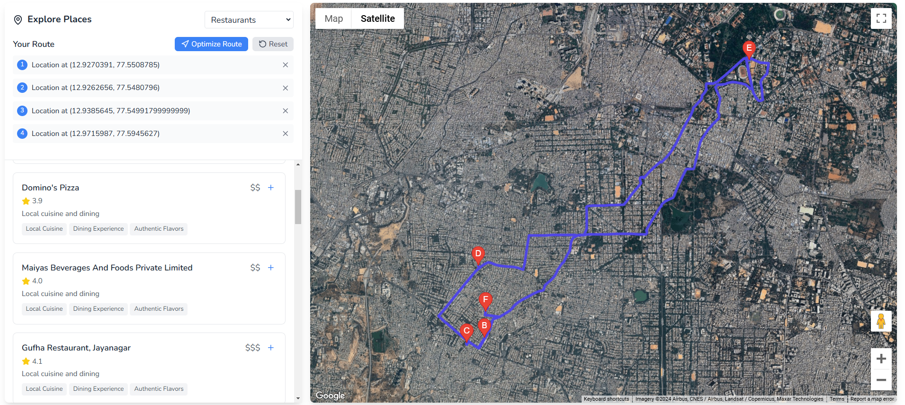

# Flyby 

Flyby is an advanced travel companion platform that revolutionizes the way travelers explore and experience new destinations. By combining real-time location intelligence, community-driven insights, and smart itinerary optimization, Flyby creates a seamless journey from inspiration to exploration.


## 🌟 Key Features

### 📍 Smart Location-Based Recommendations
- **Personalized Suggestions**: Receive tailored recommendations based on your current location
- **Local Insights**: Discover hidden gems and popular attractions in your vicinity
- **Real-time Updates**: Stay informed about nearby events and attractions


### 🗺️ Intelligent Route Optimization
- **Smart Itinerary Planning**: Automatically generate optimized routes for your wishlist
- **Time-Efficient Exploration**: Cover all your desired destinations in the most efficient way
- **Dynamic Adjustments**: Real-time route updates based on your progress



### 📝 Interactive Wishlists
- **Progress Tracking**: Automatically monitor your visited locations
- **Customizable Plans**: Create and modify your travel bucket list
- **Status Updates**: Keep track of your journey achievements

### 🏨 Comprehensive Booking System
- **One-Stop Solution**: Seamlessly book flights, hotels, and activities
- **Integrated Experience**: Manage all your reservations in one place


### 👥 Travel Community Hub
- **Local Discoveries**: Share and discover hidden gems
- **Rich Media Sharing**: Upload photos, videos, and detailed travel experiences
- **Proximity Alerts**: Receive notifications about new posts within 10km


### 🔖 Smart Bookmarking
- **Save for Later**: Bookmark interesting locations and experiences
- **Quick Access**: Easily retrieve your saved destinations


### 👤 Profile
 


 

## 🚀 Technology Stack

- **Frontend**: React.js with Vite
- **Backend**: Node.js, Express
- **Database**: Firestore
- **Authentication**: Firebase Auth
- **Maps Integration**: Google Maps API
- **Cloud Storage**: Firebase Storage
- **Deployment**: Vercel

## 🌐 Live Demo
Experience Flyby at [https://o-win-web-dev.vercel.app/](https://o-win-web-dev.vercel.app/)

## 💻 Installation

```bash
# Clone the repository
https://github.com/ShashidharM0118/O-win_WebDev.git

# Navigate to project directory
cd O-win_WebDev

# Install dependencies
npm install

# Set up environment variables
cp .env.example .env

# Start development server
npm run dev
```


👥 Contributors
<table>
  <tr>
    <td align="center">
      <a href="https://github.com/ShashidharM0118">
        <br />
        <sub><b>Shashidhar B M</b></sub>
      </a><br />
      <a href="https://www.linkedin.com/in/shashidhar-m-72183a250/" title="LinkedIn">
        
      </a>
      <br />
      <sub></sub>
    </td>
    <td align="center">
      <a href="https://github.com/k-vijay-05">
        <br />
        <sub><b>K Vijay</b></sub>
      </a><br />
      <a href="https://www.linkedin.com/in/k-vijay-39baa5257/" title="LinkedIn">
        
      </a>
      <br />
      <sub></sub>
    </td>
    <td align="center">
      <a href="https://github.com/mdkh9980">
        <br />
        <sub><b>M Hussain</b></sub>
      </a><br />
      <a href="https://www.linkedin.com/in/mohamad-hussain-0746791b3/" title="LinkedIn">
        
      </a>
      <br />
      <sub></sub>
    </td>
    <td align="center">
      <a href="https://github.com/suveerprasad">
        <br />
        <sub><b>Sai Suveer</b></sub>
      </a><br />
      <a href="https://www.linkedin.com/in/sai-suveer-96a65a1b8/" title="LinkedIn">
        
      </a>
      <br />
      <sub></sub>
    </td>
  </tr>
</table>